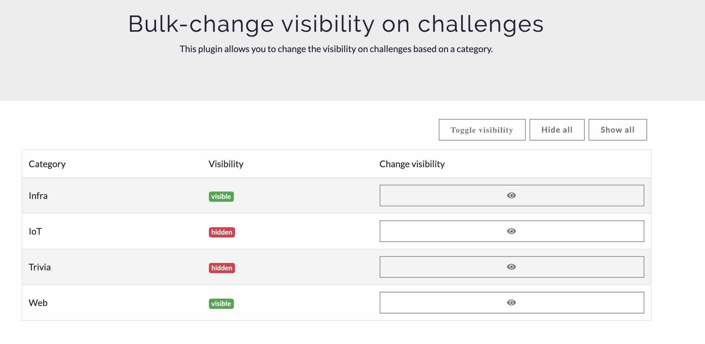

# Bulk-change visibility on challenges

Developed and verified on CTFd 2.5.0.

This plugin allows you to change the visibility on challenges based on their category, which is useful when you want to release a new category of challenges to your participants.

# How to install

Clone this repository into the CTFd/plugins folder. The plugin will be available from the plugins drop-down menu and reachable at */admin/challenges/categories*.